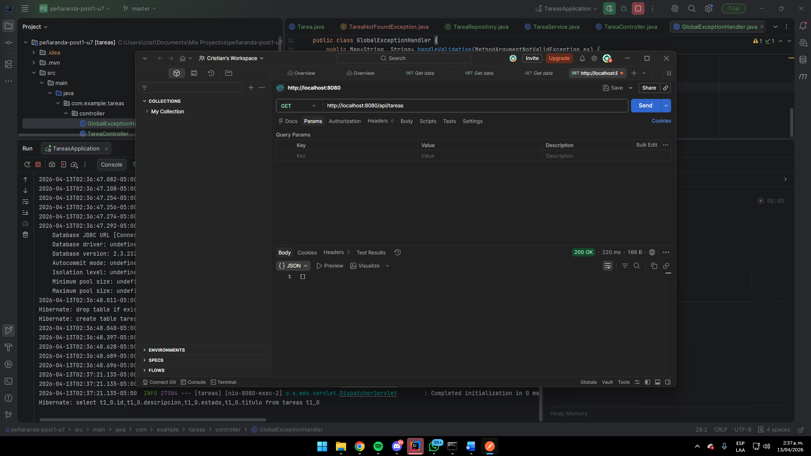
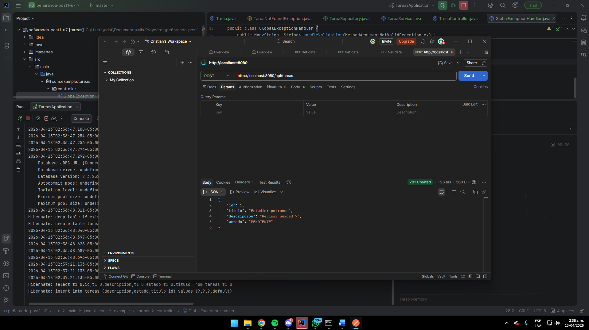
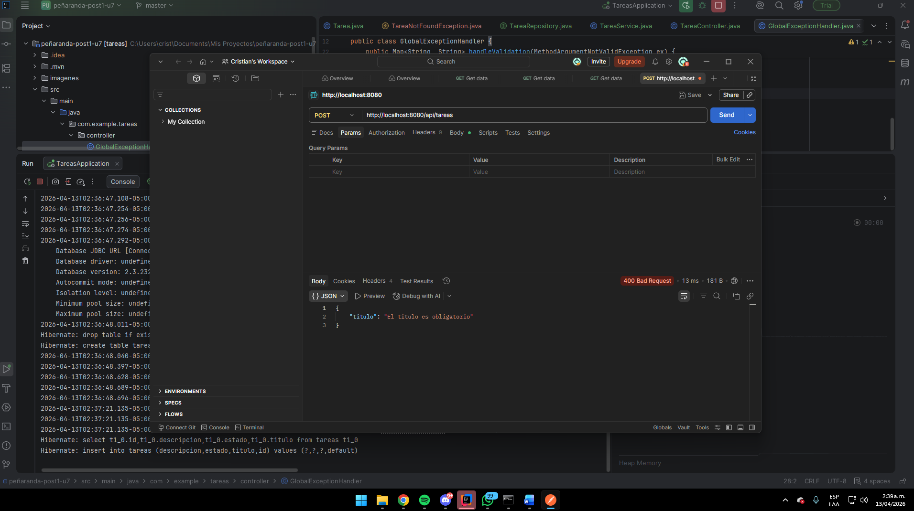
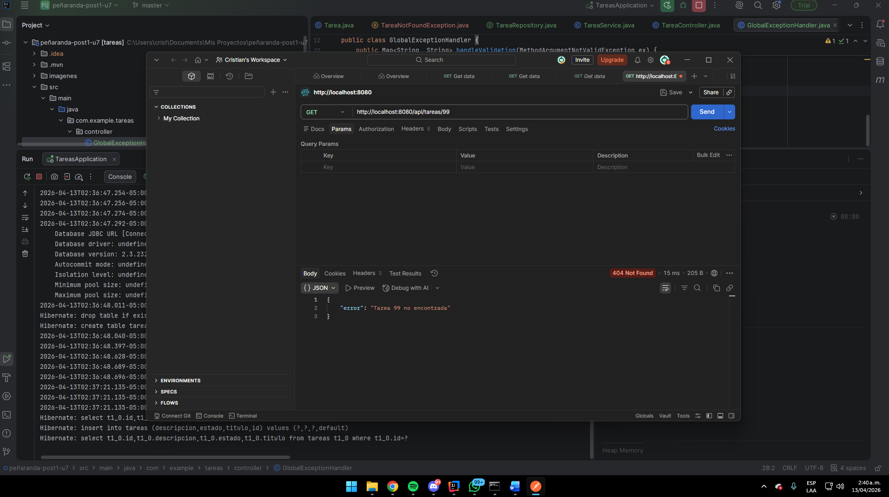
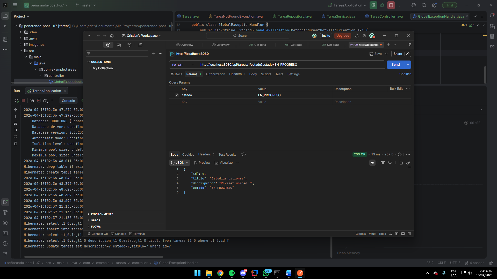
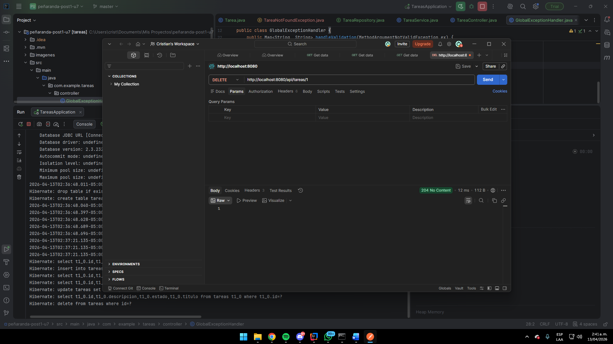

# tareas

**Unidad 7 — Post-Contenido 1**  
Curso: Patrones de Diseño de Software  
Universidad de Santander (UDES) — Ingeniería de Sistemas  
Estudiante: Cristian Alonso Peñaranda Parra  
Código: 02230131010

---

## Descripcion

API REST completa para gestión de tareas implementada con **Spring Boot 3.2**, aplicando **arquitectura en capas estricta**. El proyecto organiza el código en cuatro capas bien definidas sin dependencias cruzadas, siguiendo los principios de separación de responsabilidades y diseño limpio.

---

## Arquitectura en Capas

```
┌─────────────────────────────────────────────┐
│         CAPA DE PRESENTACION                │
│   TareaController + GlobalExceptionHandler  │
│   (@RestController, @RestControllerAdvice)  │
│   Traduce HTTP a llamadas al servicio       │
└──────────────────┬──────────────────────────┘
                   │
┌──────────────────▼──────────────────────────┐
│         CAPA DE APLICACION                  │
│              TareaService                   │
│              (@Service)                     │
│   Contiene la logica de negocio             │
└──────────────────┬──────────────────────────┘
                   │
┌──────────────────▼──────────────────────────┐
│         CAPA DE DOMINIO                     │
│   Tarea + EstadoTarea + TareaNotFoundException│
│   Entidades y excepciones de negocio        │
└──────────────────┬──────────────────────────┘
                   │
┌──────────────────▼──────────────────────────┐
│         CAPA DE INFRAESTRUCTURA             │
│           TareaRepository                  │
│           (@Repository)                    │
│   Acceso a datos con JPA/H2                 │
└─────────────────────────────────────────────┘
```

---

## Estructura de paquetes

```
com.example.tareas/
├── controller/
│   ├── TareaController.java         <- endpoints REST
│   └── GlobalExceptionHandler.java  <- manejo global de errores
├── service/
│   └── TareaService.java            <- logica de negocio
├── domain/
│   ├── model/
│   │   ├── Tarea.java               <- entidad JPA
│   │   └── EstadoTarea.java         <- enum de estados
│   └── TareaNotFoundException.java  <- excepcion de dominio
├── repository/
│   └── TareaRepository.java         <- interfaz JpaRepository
└── TareasApplication.java
```

---

## Tecnologias y dependencias

| Dependencia | Uso |
|---|---|
| Spring Boot 3.2 | Framework principal |
| Spring Web | Controladores REST |
| Spring Data JPA | Patron Repository con Hibernate |
| H2 Database | Base de datos embebida en memoria |
| Validation | Validacion con @Valid y @NotBlank |
| Java 17 | Lenguaje |
| Maven 3.8+ | Gestion de dependencias |

---

## Como ejecutar el proyecto

### Requisitos
- Java 17 o superior
- Maven 3.8+

### Pasos

```bash
# Clonar el repositorio
git clone https://github.com/CristianPrnda/penaranda-post1-u7.git
cd penaranda-post1-u7

# Ejecutar la aplicacion
mvn spring-boot:run
```

La aplicacion inicia en `http://localhost:8080`.  
La consola H2 es accesible en `http://localhost:8080/h2-console` con JDBC URL `jdbc:h2:mem:tareas_db`.

---

## Endpoints disponibles

Base URL: `http://localhost:8080/api/tareas`

| Metodo | Endpoint | Descripcion | Codigo HTTP |
|---|---|---|---|
| GET | `/api/tareas` | Listar todas las tareas | 200 OK |
| GET | `/api/tareas/{id}` | Buscar tarea por ID | 200 OK / 404 Not Found |
| POST | `/api/tareas` | Crear nueva tarea | 201 Created |
| PATCH | `/api/tareas/{id}/estado` | Cambiar estado de tarea | 200 OK |
| DELETE | `/api/tareas/{id}` | Eliminar tarea | 204 No Content |

### Estados disponibles
- `PENDIENTE`
- `EN_PROGRESO`
- `COMPLETADA`

---

## Ejemplos de uso

**Crear una tarea:**
```bash
curl -X POST http://localhost:8080/api/tareas \
  -H "Content-Type: application/json" \
  -d '{"titulo":"Estudiar patrones","descripcion":"Revisar unidad 7"}'
```

**Listar todas las tareas:**
```bash
curl http://localhost:8080/api/tareas
```

**Cambiar estado:**
```bash
curl -X PATCH "http://localhost:8080/api/tareas/1/estado?estado=EN_PROGRESO"
```

**Eliminar tarea:**
```bash
curl -X DELETE http://localhost:8080/api/tareas/1
```

---

## Manejo de errores

| Situacion | Codigo | Respuesta |
|---|---|---|
| Tarea no encontrada | 404 Not Found | `{"error": "Tarea X no encontrada"}` |
| Titulo vacio en POST | 400 Bad Request | `{"titulo": "El titulo es obligatorio"}` |
| Eliminacion exitosa | 204 No Content | (sin cuerpo) |

---

## Evidencia de funcionamiento

### GET /api/tareas — lista vacia al inicio


### POST /api/tareas — crear tarea (201 Created)


### POST /api/tareas sin titulo — validacion (400 Bad Request)


### GET /api/tareas/99 — ID inexistente (404 Not Found)


### PATCH /api/tareas/1/estado — cambiar estado


### DELETE /api/tareas/1 — eliminar (204 No Content)


---

## Checkpoints cumplidos

- El proyecto compila sin errores con `mvn clean compile`
- La estructura de paquetes refleja las cuatro capas definidas
- GET /api/tareas retorna lista vacia (200 OK) al inicio
- POST /api/tareas con JSON valido retorna 201 Created
- POST /api/tareas sin titulo retorna 400 Bad Request con mensaje de validacion
- GET /api/tareas/{id} con ID inexistente retorna 404 Not Found
- PATCH /api/tareas/{id}/estado actualiza el estado correctamente
- DELETE /api/tareas/{id} retorna 204 No Content
- El repositorio tiene minimo 3 commits descriptivos